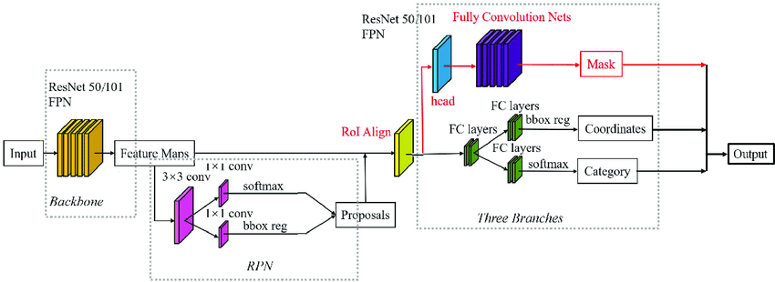
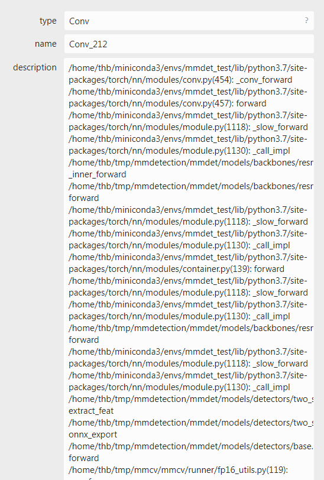
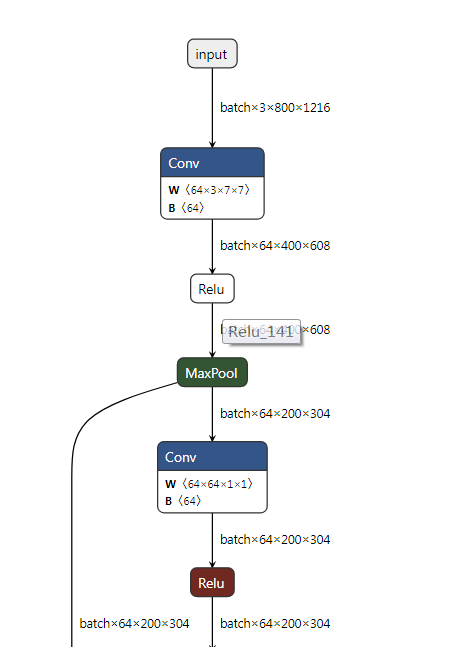

# 基于mmdet的maskrcnn在TensorRT上的端到端部署与精度对齐

## 零. 前言
一直想对去年做的`FasterRCNN+ROIAlign+FPN`在TensorRT上的部署做个升级，之前的版本包含如下缺点：
1. 训练代码需要自己编写
2. 仅支持batch size = 1的推理
3. 模型将onnx切成两部分来实现（RPN+ROIHead两部分），中间采用了部分cuda实现ROIAlign和ROIHead的NMS，没有做到端到端的部署
4. 用于nms采用TensorRTPro中的nms，TensorRT推理结果没有与Pytorch对齐
5. 没有FP16支持

针对如上缺点，笔者决定基于mmdet来给读者展示如何一步步将上面的缺点给解决掉。首先，采用mmdet后训练代码就完全交给了该框架。其次mmcv中包含丰富的TensorRT插件，这样可以解决精度对齐的问题和端到端部署的问题。再者，动态batch的支持问题也已经通过mmdet中的部署经验得到解决。最后，FP16的支持笔者耗费了一些时间来定位误差层，成功解决了FP16输出中含有`nan`的问题。

本文所有源码都在：  https://github.com/thb1314/maskrcnn-tensorrt  

同时，本文对应的视频教程也放进了B站，点此链接进行观看


## 一. mmdet中的MaskRCNN模型结构

为什么会有这一章呢？显然是想强调下mmdet中的MaskRCNN模型结构与论文中MaskRCNN描述的不一样。

MaskRCNN常规结构图如下图所示：
  
其组成部分为 `FasterRCNN + FPN + ROIAlign + FCN`。先说一下上图中不严谨的点，RPN部分输出不应该是softmax（当前softmax也可以做二分类），sigmoid更为适合，RPN的作用就是判断当前预测是否是物体。RPN产生的`proposals`送入`RoIAlign`后输出固定大小的feature map，输入给后续的`RoIHead`。

接下来就是重点了，常规的MaskRCNN中的`RoIHead`中分割map的预测和框的预测是并行进行的，也就是说这两个是两个并行的分支(这两个分支分别为FCN+BoxHead)。 但是，在mmdet的实现中，对框的预测过程和对分割map的预测过程是串联关系，也就是`RoIAlign`提取的RPN生成的粗糙框的信息对应的`feature map`生成修正的更为精准的框预测和细粒度的分类预测，然后再将该修正的框预测和FPN输出的特征送入`RoIAlign`（注意这是第二个哦，前面的用于生成框了）生成`feature map`，最后利用上述的`feature map`送入FCN分割mask预测。

这在mmdet中`StandardRoIHead`代码中也有体现（读者可以搜索`class StandardRoIHead`来观察），下面给出关键代码：

```python
def onnx_export(self, x, proposals, img_metas, rescale=False):
    """Test without augmentation."""
    assert self.with_bbox, 'Bbox head must be implemented.'
    det_bboxes, det_labels = self.bbox_onnx_export(
        x, img_metas, proposals, self.test_cfg, rescale=rescale)

    if not self.with_mask:
        return det_bboxes, det_labels
    else:
        segm_results = self.mask_onnx_export(
            x, img_metas, det_bboxes, det_labels, rescale=rescale)
        return det_bboxes, det_labels, segm_results

```

如上面函数所示，`x`表示FPN输出的特征，`onnx_export`函数中的流程就是先检测出`det_bboxes`和`det_labels`，然后再检测出`segm_results`。在`mask_onnx_export`中会调用`_mask_forward`, 可以看到如下操作，此处及证明了上面说的串联关系，`mask_roi_extractor`就是`RoIAlign`。

```python
def _mask_forward(self, x, rois=None, pos_inds=None, bbox_feats=None):
    """Mask head forward function used in both training and testing."""
    assert ((rois is not None) ^
            (pos_inds is not None and bbox_feats is not None))
    if rois is not None:
        mask_feats = self.mask_roi_extractor(
            x[:self.mask_roi_extractor.num_inputs], rois)
        if self.with_shared_head:
            mask_feats = self.shared_head(mask_feats)
    else:
        assert bbox_feats is not None
        mask_feats = bbox_feats[pos_inds]

    mask_pred = self.mask_head(mask_feats)
    mask_results = dict(mask_pred=mask_pred, mask_feats=mask_feats)
    return mask_results
```

## 二. 环境安装

本文实验的硬件和操作系统环境如下：

- NVIDIA GPU 2080Ti
- Ubuntu 22.04.1 LTS
- NVIDIA GPU Driver Version: 515.65.01

### 2.1 TensorRT安装
笔者采用的TensorRT版本为`8.4.1.5`，cuda版本为`10.2`，cudnn版本为`8.5.0`。cuda和cudnn的安装还请自行百度，不在本次教程的内容范围以内。原则上，读者的TensorRT版本只需要跟我保持一致即可，cuda和cudnn的版本的可以放宽限制。

TensorRT的C++版本安装后，还请读者安装python的包，whl就在`xxx/TensorRT-8.4.1.5/python`下面。  

此外，还需要安装pycuda，读者新建好conda或者virtualenv的虚拟环境后采用`pip install pycuda==2022.1`安装即可（cuda10.2亲测可用）


### 2.2 编译工具的降级

由于cuda10.2对gcc/g++版本要求为5.0-8.0版本，所以还请读者自行安装本版本的工具，如果觉得自己的linux系统库不是很方便可以采用docker的方式解决。  

如果读者cuda的版本不是10.2，请自行解决gcc/g++版本限制问题，后面能保证maskrcnn所需要的TensorRT相关插件即可。

### 2.3 mmdet的安装

新建虚拟环境
```bash
conda create -n mmdet_test python=3.7
conda activate mmdet_test
```

安装pytorch，按照自己实际情况来安装，不推荐使用conda安装`cudatookit`，因为会存在自身cuda cudnn库与conda中的库版本冲突的问题，只用torch问题不大，但是如果是使用TensorRT可能会出问题。

```
pip install typing_extensions==4.5.0
```

```bash
# CUDA 10.2
pip install torch==1.12.1+cu102 torchvision==0.13.1+cu102 torchaudio==0.12.1 --extra-index-url https://download.pytorch.org/whl/cu102
```

安装onnxruntime的lib库
```bash
# 切换到代码目录
wget https://github.com/microsoft/onnxruntime/releases/download/v1.12.1/onnxruntime-linux-x64-1.12.1.tgz
tar -zxvf onnxruntime-linux-x64-1.12.1.tgz
cd onnxruntime-linux-x64-1.12.1
export ONNXRUNTIME_DIR=$(pwd)
export LD_LIBRARY_PATH=$ONNXRUNTIME_DIR/lib:$LD_LIBRARY_PATH
```

```bash
pip install onnx==1.11.0
pip install onnxruntime==1.12.1
pip install onnxsim==0.4.8
```

mmcv和mmdetection安装
```bash
pip install mmengine==0.5.0
pip install openmim==0.3.5
pip install chardet==5.1.0
# 安装mmcv
git clone -b v1.7.1 --single-branch https://github.com/open-mmlab/mmcv.git mmcv
cd mmcv
# 编译安装mmcv相关onnxruntime算子
MMCV_WITH_OPS=1 MMCV_WITH_ORT=1 python setup.py develop
cd ..
git clone -b 'v2.27.0' --single-branch https://github.com/open-mmlab/mmdetection.git mmdetection
cd mmdetection
pip install -v -e .
# 安装 protobuf
pip install protobuf==3.20.0
```

修改mmdet适配maskrcnn的onnx的导出，建议这一步先不要执行，如果是为了立即使用看效果的读者可以这么做。后面本文会一步步的展示原版的mmdet中的MaskRCNN有什么问题，并告知作者是怎么一步步解决它的。
```bash
cp patch/mmdet/* mmdetection/mmdet/ -rf
```

> Note：  
> 每次开机或者打开重新打开命令行时，在shell环境中都需要重新将onnxruntime lib目录加入到`LB_LIBRARY_PATH`中。读者也可以在~/.bashrc对`LB_LIBRARY_PATH`做永久更改，原理都是一样的。
这里给出添加命令：

```bash
cd onnxruntime-linux-x64-1.12.1
export ONNXRUNTIME_DIR=$(pwd)
export LD_LIBRARY_PATH=$ONNXRUNTIME_DIR/lib:$LD_LIBRARY_PATH
```

## 三. 下载预训练模型并采用Pytorch API推理

### 3.1 采用min下载配置文件和预训练模型

我们都知道，mmdet中模型的结构和训练和推理方式的定义采用`xxx.py`来配置，采用如下指令下载预训练模型和对应的config配置文件
```bash
cd scripts
mkdir -p models/mask-rcnn
mim download mmdet --config mask_rcnn_r50_fpn_2x_coco --dest models/mask-rcnn
cd models/mask-rcnn
mkdir config
mv mask_rcnn_r50_fpn_2x_coco.py ./config
mkdir pretrained_model
mv *.pth pretrained_model
cd ../../../
```

### 3.2 采用Pytorch API进行推理并进行可视化

mmdet中的模型都有可视化推理结果的功能，`model.show_result`简单一句api可将推理结果进行可视化。
首先调用`init_detector`构建模型，并将预训练模型加载，然后调用`inference_detector`将图片送入模型进行推理，最后调用`model.show_result`进行可视化。

代码如下（对应路径`scripts/codes/001infer_maskrcnn_mmdet_api.py`）：

```python
from mmdet.apis import init_detector, inference_detector
import os
import glob
import mmdet


dirpath = os.path.dirname
path_join = os.path.join
BASE_DIR = path_join(dirpath(dirpath(os.path.realpath(__file__))), 'models', 'mask-rcnn')
MMDET_DIR = dirpath(dirpath(mmdet.__file__))
print('BASE_DIR', BASE_DIR)
print('MMDET_DIR', MMDET_DIR)

config_file = path_join(BASE_DIR, 'config', 'mask_rcnn_r50_fpn_2x_coco.py')
checkpoint_file = path_join(BASE_DIR, 'pretrained_model', 'mask_rcnn_r50_fpn_2x_coco_*.pth')
checkpoint_file = glob.glob(checkpoint_file)[0]

model = init_detector(config_file, checkpoint_file, device='cpu')
jpg_image_path = path_join(MMDET_DIR,  'demo', 'demo.jpg')
det_result = inference_detector(model, jpg_image_path)

basename_woext, ext = os.path.splitext(os.path.basename(jpg_image_path))
result_pred_path = path_join('../results', basename_woext + '_result' + ext)
os.makedirs(dirpath(result_pred_path), exist_ok=True)

model.show_result(jpg_image_path, det_result, out_file=result_pred_path)

```

## 四. 导出maskrcnn的onnx并采用onnxruntime执行onnx

### 4.1 初步导出onnx

作者参照`mmdetection/tools/deployment/pytorch2onnx.py`文件，修改其中的`pytorch2onnx`函数，直接采用代码方式构建导出功能，关键代码如下（完整代码路径在`scripts/codes/002export_onnx.py`）：

```python
import os
import glob
import mmdet


dirpath = os.path.dirname
path_join = os.path.join
BASE_DIR = path_join(dirpath(dirpath(os.path.realpath(__file__))), 'models', 'mask-rcnn')
MMDET_DIR = dirpath(dirpath(mmdet.__file__))
print('BASE_DIR', BASE_DIR)
print('MMDET_DIR', MMDET_DIR)

config_file = path_join(BASE_DIR, 'config', 'mask_rcnn_r50_fpn_2x_coco.py')
checkpoint_file = path_join(BASE_DIR, 'pretrained_model', 'mask_rcnn_r50_fpn_2x_coco_*.pth')
checkpoint_file = glob.glob(checkpoint_file)[0]

opset_version = 11
try:
    from mmcv.onnx.symbolic import register_extra_symbolics
except ModuleNotFoundError:
    raise NotImplementedError('please update mmcv to version>=v1.0.4')
register_extra_symbolics(opset_version)

cfg = Config.fromfile(config_file)
img_scale = [800, 1216]
input_shape = (1, 3, img_scale[0], img_scale[1])


# build the model and load checkpoint
model = build_model_from_cfg(config_file, checkpoint_file)
jpg_image_path = path_join(MMDET_DIR,  'demo', 'demo.jpg')
normalize_cfg = parse_normalize_cfg(cfg.test_pipeline)
basename_woext, ext = os.path.splitext(os.path.basename(config_file))

# convert model to onnx file
pytorch2onnx(
    model,
    jpg_image_path,
    input_shape,
    normalize_cfg,
    opset_version=opset_version,
    show=True,
    output_file=basename_woext+'.onnx',
    verify=True,
    test_img=None,
    do_simplify=True,
    dynamic_export=False,
    skip_postprocess=False,
    force_write=True)
```


执行`scripts/codes/002export_onnx.py`后，首先会遇到
```
RuntimeError: Only tuples, lists and Variables are supported as JIT inputs/outputs. Dictionaries and strings are also accepted, but their usage is not recommended. Here, received an input of unsupported type: numpy.ndarray
```
原因：
代码中`one_meta`字典中的`scale_factor`是一个np.ndarray，这个在torch.jit时被追踪到，我们只需要对`preprocess_example_input`函数最后的返回值加以改造即可。

对`mmdetection/mmdet/core/export/pytorch2onnx.py`文件`Line 148`修改如下:
```python
one_meta = {
        'img_shape': (H, W, C),
        'ori_shape': (H, W, C),
        'pad_shape': (H, W, C),
        'filename': '<demo>.png',
        'scale_factor': np.ones(4, dtype=np.float32).tolist(),
        'flip': False,
        'show_img': torch.as_tensor(show_img),
        'flip_direction': None
    }
```

对上面进行更改后，`mmdet/models/roi_heads/test_mixins.py`中`simple_test_mask`会报错，这里需要适配一下。

```bash
# 读者可以自行查看做了哪些更改
diff patch/mmdet/models/roi_heads/test_mixins.py mmdetection/mmdet/models/roi_heads/test_mixins.py
# 可以看到仅仅是将`torch.from_numpy`改成了`torch.as_tensor`
cp patch/mmdet/models/roi_heads/test_mixins.py mmdetection/mmdet/models/roi_heads/test_mixins.py -rf
```

然后会碰到mmcv中的`imread`函数，在203行下面添加如下逻辑：
```python
elif isinstance(img_or_path, torch.Tensor):
    return img_or_path.detach().cpu().numpy()
```
`torch`的导入加入到`mmcv/mmcv/image/io.py`文件前面

最终我们终于导出了maskrcnn的onnx，并且采用onnxruntime与pytorch分别进行推理，最后尴尬的发现这两者结果并没有对齐，这是为何呢？下一小节给读者说明我们是如果定位这个bug的。


### 4.2 解决onnx与pytorch输出结果不一致的问题

已知torch和onnxruntime这两种框架相同模型针对相同输入最终输出不一致，我们需要的是制作定位精度不一致的工具。简单分析就是中间结果的不一致导致了最终结果的不一致，因此我们需要一个可以得到中间结果的工具。

针对Pytorch模型，我们可以在其各个`nn.Module`组件中的forward函数里面插入如下语句将中间结果保存（当然也可以写hook，不过没必要）：

```python
def forward(self, x)
    x = children_module1(x)
    torch.save({'x':x}, 'xxx.pkl')
    # ...
```

即调用`torch.save`来调用实现对中间结果的序列化以及离线存储。  

针对ONNX存储格式，首先需要将需要捕获的结点的名字找到，这些名字存在于`onnx.model.graph.node`的`input`和`output`列表当中，你可以用`onnx`遍历onnx模型，然后得到某类算子的输出，并将其加入到`onnx.model.output`中。具体代码如下（参考`patch/mmdet/core/export/model_wrappers.py`）：

```python
onnx_model = onnx.load(onnx_file)
ori_output = copy.deepcopy(onnx_model.graph.output)
# 输出模型每层的输出
for node in onnx_model.graph.node:
    # 加限制条件 获取满足如下条件的node的输出
    if not (node.op_type in ['NonMaxSuppression', 'Concat', 'TopK', 'Sigmoid', 'Mul'] or \
        node.name in ['Reshape_1686', 'onnx::Mul_2265'] or node.output[0] in ['onnx::Mul_2265', \
        'onnx::Reshape_2348', 'onnx::Gather_2347', 'onnx::Gather_2337']):
        continue
    
    for output in node.output:
        if output not in ori_output:
            onnx_model.graph.output.extend([onnx.ValueInfoProto(name=output)])
sess = ort.InferenceSession(onnx_model.SerializeToString(), session_options)
```

然后在推理过程中拿到最终输出的dict，通过观察输出onnx与torch节点之间的等价关系，通过二分法定位出哪个输出不一样。当然这个过程很辛苦。

还有一个小技巧，除了自己推断torch中forward运算和onnx算子之间关系之外，还可以采用在导出onnx时，将`verbose`参数设置为`True`的方式来记录onnx算子的生成过程，这样onnx算子中`description`属性中就记录了整个过程。如下图所示：  

  

作者正是通过如上途径，一步步定位到是RPN模型的NMS输出不一致，为什么不一致呢？

这是因为由于FPN的存在，RPN推理在NMS阶段是需要对FPN中每个stage的输出单独执行NMS后处理的，这种方式就类似于把每个stage的输出看做不同类别，采用类间NMS做后处理。  

但是，在导出onnx的过程中，mmdet简化了该步骤，即把所有的框都当做同一个stage输出的来看到，从而导致onnxruntime与torch的不一致。追溯源码过程如下：

1. 首先从config文件中找到RPN中Head部分，Head部分才包含NMS，此时我们找到`RPNHead`类
2. 使用`class RPNHead`关键词找到（笔者使用的是VSCode的全文搜索功能）`mmdetection/mmdet/models/dense_heads/rpn_head.py`文件（也可以通过在netron中查看导出的onnx模型中的`NonMaxSuppression`算子然后找到位置`mmdetection/mmdet/models/dense_heads/rpn_head.py(264)`）。
3. 定位到导出的函数为`add_dummy_nms_for_onnx`
4. 此时你会看到mmdet官方给的注释，这就是根因所在
   ```python
   # Different from the normal forward doing NMS level by level,
   # we do NMS across all levels when exporting ONNX.
   ```

**那么如何解决呢？**

如果读者阅读过torchvision中`batched_nms`的实现，你一定就会知道针对类间和不同batch的nms是怎么转换为类内的nms的。
参考代码链接：[https://github.com/pytorch/vision/blob/505cd6957711af790211896d32b40291bea1bc21/torchvision/ops/boxes.py#L39](https://github.com/pytorch/vision/blob/505cd6957711af790211896d32b40291bea1bc21/torchvision/ops/boxes.py#L39)  
这里引用代码中关键的一段注释来说明思路：
```python
# strategy: in order to perform NMS independently per class.
# we add an offset to all the boxes. The offset is dependent
# only on the class idx, and is large enough so that boxes
# from different classes do not overlap
```
同时mmcv中也给出相应`batch_nms`的实现，位置在`mmcv/mmcv/ops/nms.py` Line 264。

我们根据如上思路通过修改`RPNHead`中的`onnx_export`函数以及mmdet中的`add_dummy_nms_for_onnx`函数，为其增加支持类间nms的功能。

首先，针对每个level的box，我们需要给他们一个标记，表示他们属于哪个stage输出的。代码如下
```python
ids_list = []
nms_pre_tensor = torch.tensor(cfg.get('nms_pre', -1), device=cls_scores[0].device, dtype=torch.long)
for i in range(num_levels):
    c, h, w = list(map(int, cls_scores[i].shape[1:4]))
    cur_lvl_length = torch.as_tensor(c * h * w, dtype=torch.long, device=cls_scores[0].device)
    topk = get_k_for_topk(nms_pre_tensor, cur_lvl_length)
    if topk > 0 and topk != int(cur_lvl_length):
        cur_lvl_length = topk
    # 最关键一步，给每个层级打上标签
    ids_list.append(torch.full((1, cur_lvl_length, 1), fill_value = i, dtype=torch.long, device=cls_scores[0].device))
# [1, num_boxes, 1] 
idxs = torch.cat(ids_list, dim=1)
```

接着，我们将`idxs`传入`add_dummy_nms_for_onnx`，修改`add_dummy_nms_for_onnx`去适配该类信息。
首先我们需要对之前的方式做兼容，当idxs存在时再做处理

```python
boxes_for_nms = boxes
if idxs is not None:
    # [b,1,1]
    max_coordinate, _ = boxes.max(dim=1, keepdim=True)
    max_coordinate, _ = max_coordinate.max(dim=2, keepdim=True)
    # [b,N,1]
    offsets = idxs.to(boxes) * (max_coordinate + torch.tensor(1).to(boxes))
    boxes_for_nms = boxes + offsets.view(1, num_box, 1)
```
以上就是关键适配代码，逻辑完全借鉴`batched_nms`的实现，至于不同batch之间的nms逻辑，这里onnx的`NonMaxSuppression`本身就支持，所以就不需要再考虑。

采用如下方式替换代码，解决精度对齐问题

```bash
# 读者可以自行查看做了哪些更改
diff patch/mmdet/models/dense_heads/rpn_head.py mmdetection/mmdet/models/dense_heads/rpn_head.py
cp patch/mmdet/models/dense_heads/rpn_head.py mmdetection/mmdet/models/dense_heads/rpn_head.py -rf

# 读者可以自行查看做了哪些更改
diff patch/mmdet/core/export/onnx_helper.py mmdetection/mmdet/core/export/onnx_helper.py
cp patch/mmdet/core/export/onnx_helper.py mmdetection/mmdet/core/export/onnx_helper.py -rf
```

执行完上面代码之后，我们可以看到`onnxruntime`和`torch`的结果还是不一样？啥情况呢？

不要灰心，实际上仔细阅读`ONNXRuntimeDetector`源码之后，你会发现后处理还是有些不一样，比如没有`ONNXRuntimeDetector`没有对nms中的无效框进行过滤，这个时候需要我们改源码加上此类逻辑（在`mmdetection/mmdet/core/export/model_wrappers.py`上）

```python
for i in range(batch_size):
    dets, labels = batch_dets[i], batch_labels[i]
    det_mask = np.sum(dets, axis=-1) >= 1e-3
    dets = dets[det_mask]
    labels = labels[det_mask]
```

下面给出命令

```python
# 读者可以自行查看做了哪些更改
diff patch/mmdet/core/export/model_wrappers.py mmdetection/mmdet/core/export/model_wrappers.py
cp patch/mmdet/core/export/model_wrappers.py mmdetection/mmdet/core/export/model_wrappers.py -rf
```

最后重新运行`002export_onnx.py`，结果终于完全一致，此时我们可以长呼一口气放松一下。


## 五. 采用TensorRT推理MaskRCNN

### 5.1 分析缺少哪些算子以及相应插件编译

下面是一份TensorRT官方发布的支持的算子的清单： 

https://github.com/onnx/onnx-tensorrt/blob/release/8.4-GA/docs/operators.md

我们可以看到`ROIAlign`和`gridmask`算子在TensorRT中是不支持的（NonMaxSuppression在TRT8.4已经支持），那么碰到不支持的又该怎么办呢？


先采用直接转engine的方式看一下会报什么错误：

```bash
trtexec --onnx=../results/mask_rcnn_r50_fpn_2x_coco.onnx \
        --saveEngine=../results/mask_rcnn_r50_fpn_2x_coco.onnx.engine \
        --workspace=10240
```

结果
```
input: "rois.3"
output: "onnx::Mul_2534"
name: "MMCVRoiAlign_1931"
op_type: "MMCVRoiAlign"
```
回报上述算子找不到，这里我们可以写插件支持它，在去年的时候这里的cuda部分我还是抄的onnxruntime的GPU实现，并且没有用到插件实现，而是采用纯cuda的方式。  
幸运的是MMCV除了给我们提供了onnxruntime的自定义算子的实现，也给我们提供了TensorRT不支持算子的插件实现，具体位置在`mmcv/mmcv/ops/csrc/tensorrt` 。由于其提供的插件适配的版本为TRT7.x的，我们需要简单修改适配下，作者已经将是配好的版本放在了`scripts/relaventTensorRTPlugin`中。


这里我们先编译一下`MMCVRoiAlign`插件，看看还缺少什么。
> 这里读者要注意更改Makefile里面的`SM`，让其适配自己的GPU。

```bash
trtexec --onnx=../results/mask_rcnn_r50_fpn_2x_coco.onnx \
        --saveEngine=../results/mask_rcnn_r50_fpn_2x_coco.onnx.engine \
        --workspace=10240 \
        --plugins="../relaventTensorRTPlugin/build/MMCVRoiAlign.so"
```

报如下错误：

```
input: "grid"
output: "onnx::Gather_3387"
name: "grid_sampler_2715"
op_type: "grid_sampler"
```

相似原理，我们到`grid_sampler`下面去编译生成对应插件，然后执行：

```bash
trtexec --onnx=../results/mask_rcnn_r50_fpn_2x_coco.onnx \
        --saveEngine=../results/mask_rcnn_r50_fpn_2x_coco.engine \
        --workspace=10240 \
        --plugins="../relaventTensorRTPlugin/build/MMCVRoiAlign.so" \
        --plugins="../relaventTensorRTPlugin/build/grid_sampler.so"
```

至此我们就生成了对应的trt编译后的`engine`文件，至于`NonMaxSuppression`和`ScatterND`是为了适配低版本TensorRT设置的，采用低版本TensorRT的读者可以自行探索。
再次感谢MMCV提供这么方便的TensorRT插件的实现。

### 5.2 TensorRT FP32模型精度对齐

已知onnxruntime与torch针对相同的输入可以得到相同的输出，那么如果需要做到精度对齐，我们只需要对齐onnxruntime与TensorRT的输出即可。

首先我们先保存下onnxruntime的输出，运行`scripts/codes/003run_on_onnx.py`得到`onnx_output_dict.pkl`文件，里面记录了针对demo jpg得到的输出，可视化结果在`scripts/results/onnxruntime_result.png`。  


然后，我们运行`004run_on_tensorrt.py`（我们的004也支持build engine），等好久的模型转为engine的过程后，最终会得到输出

```
key: labels, diff: 0
key: dets, diff: 0.000244140625
key: masks, diff: 0.0
```

这个时候有没有感到成就感爆棚？我们克服了重重苦难，最终成功将onnx转换为engine，并且得到了与onnx运行相同的结果！

然而这不是终点，优化永无尽头，下面我们看一下动态batch的支持问题。

## 六. 动态batch的支持

### 6.1 导出动态batch的onnx

首先要想获得支持动态batch的trt模型，我们需要导出的onnx本身就支持动态维度。下面给出之前文章中反复强调的导出原则：

1. 对于任何用到shape、size返回值的参数时，例如：`tensor.view(tensor.size(0), -1)`，`B,C,H,W = x.shape` 这类操作，避免直接使用tensor.size的返回值，而是加上int转换，`tensor.view(int(tensor.size(0)), -1)`, `B,C,H,W = map(int, x.shape)`，断开跟踪。
2. 对于nn.Upsample或nn.functional.interpolate函数，一般使用scale_factor指定倍率，而不是使用size参数指定大小。如果源码中就是插值为固定大小，则该条忽略。
3. 对于reshape、view操作时，-1的指定请放到batch维度。其他维度计算出来即可。batch维度禁止指定为大于-1的明确数字。如果是一维，那么直接指定为-1就好。
4. torch.onnx.export指定dynamic_axes参数，并且只指定batch维度，禁止其他动态
5. 使用opset_version=11，不要低于11
6. 避免使用inplace操作，例如`y[…, 0:2] = y[…, 0:2] * 2 - 0.5`，可以采用如下代码代替 `tmp = y[…, 0:2] * 2 - 0.5; y = torch.cat((y[..., 2:], tmp), dim = -1)`

7. 尽量少的出现5个维度，例如ShuffleNet Module，可以考虑合并wh避免出现5维

8. 尽量把让后处理部分在onnx模型中实现，降低后处理复杂度。比如在目标检测网络中最终输出设置为xywh或者xyxy，而不是一个中间结果。

接着按照以上原则修改代码，修改如下：
```python
# 读者可以自行查看做了哪些更改
diff patch/mmdet/core/bbox/coder/delta_xywh_bbox_coder.py mmdetection/mmdet/core/bbox/coder/delta_xywh_bbox_coder.py
cp patch/mmdet/core/bbox/coder/delta_xywh_bbox_coder.py mmdetection/mmdet/core/bbox/coder/delta_xywh_bbox_coder.py -rf

# 读者可以自行查看做了哪些更改
diff patch/mmdet/models/dense_heads/base_dense_head.py mmdetection/mmdet/models/dense_heads/base_dense_head.py

cp patch/mmdet/models/dense_heads/base_dense_head.py mmdetection/mmdet/models/dense_heads/base_dense_head.py -rf

# 读者可以自行查看做了哪些更改
diff patch/mmdet/models/detectors/two_stage.py mmdetection/mmdet/models/detectors/two_stage.py 
cp patch/mmdet/models/detectors/two_stage.py mmdetection/mmdet/models/detectors/two_stage.py  -rf

# 读者可以自行查看做了哪些更改
diff patch/mmdet/models/roi_heads/standard_roi_head.py mmdetection/mmdet/models/roi_heads/standard_roi_head.py 
cp patch/mmdet/models/roi_heads/standard_roi_head.py mmdetection/mmdet/models/roi_heads/standard_roi_head.py -rf

# 读者可以自行查看做了哪些更改
diff patch/mmdet/models/roi_heads/bbox_heads/convfc_bbox_head.py mmdetection/mmdet/models/roi_heads/bbox_heads/convfc_bbox_head.py
cp patch/mmdet/models/roi_heads/bbox_heads/convfc_bbox_head.py mmdetection/mmdet/models/roi_heads/bbox_heads/convfc_bbox_head.py -rf


# 读者可以自行查看做了哪些更改
diff patch/mmdet/models/roi_heads/mask_heads/fcn_mask_head.py mmdetection/mmdet/models/roi_heads/mask_heads/fcn_mask_head.py
cp patch/mmdet/models/roi_heads/mask_heads/fcn_mask_head.py mmdetection/mmdet/models/roi_heads/mask_heads/fcn_mask_head.py -rf

# 读者可以自行查看做了哪些更改
diff patch/mmdet/models/roi_heads/standard_roi_head.py mmdetection/mmdet/models/roi_heads/standard_roi_head.py
cp patch/mmdet/models/roi_heads/standard_roi_head.py mmdetection/mmdet/models/roi_heads/standard_roi_head.py -rf

```


实际上有些文件的修改还是比较关键的，比如`two_stage.py`，对此文件的修改是为了满足`ROIAlign`算子对矩形有效性的要求。这在导出静态onnx时问题可能没有暴露出来，但是在导出动态batch的onnx时问题就显现出来了。

最后运行`scripts/codes/005export_onnx_with_dynamic_shape.py`，成功导出支持动态batch的onnx。

  


### 6.2 TensorRT模型动态batch的测试

废话不多说，配置好`max_batch_size`，直接转为trt的模型序列化文件。然后运行`scripts/codes/006run_on_tensorrt_dynamic_shape.py`

输出：
```
key: labels, shape: (2, 100), diff: 0
key: dets, shape: (2, 100, 5), diff: 0.000244140625
key: masks, shape: (2, 100, 800, 1216), diff: 0.0
```

Nice！

接下来我们再进一步，看一下FP16能否实现。

## 七. FP16 NAN问题的解决

### 7.1 初步尝试转换fp16 TensorRT engine

我们将`scripts/codes/006run_on_tensorrt_dynamic_shape.py`复制一份，copy为`007run_on_tensorrt_dynamic_shape_fp16.py`，然后将Line171行的`enable_fp16`设置为`True`。

这个时候我们发现
```
key: labels, shape: (2, 100), diff: 56
key: dets, shape: (2, 100, 5), diff: nan
key: masks, shape: (2, 100, 800, 1216), diff: 1.0
```

### 7.2 定位NAN出现层

dets出现了NAN，那么哪些层会出输出NAN呢？这个需要我们去获得TensorRT中间层的输出。我们可以采用`polygraphy`，也可以自己写相关代码。本质都是一样，`polygraphy`最后也是通过修改tensorRT network的代码来完成的。

由于TensorRT不能输出int8和bool类型的变量，所以我们需要获取到其他的可以导出的中间层变量的名字。详情见`007run_on_tensorrt_dynamic_shape_fp16.py`

下面我们我们修改`build_engine`函数，通过修改`network`来获取中间输出

```python
def build_engine(onnx_file_path, enable_fp16=False, max_batch_size=1, max_workspace_size=10, write_engine=True):
    # 通过加载onnx文件，构建engine
    # :param onnx_file_path: onnx文件路径
    # :return: engine

    onnx_path = os.path.realpath(onnx_file_path) 
    engine_file_path = ".".join(onnx_path.split('.')[:-1] + ['engine' if not enable_fp16 else 'fp16.engine'])
    print('engine_file_path', engine_file_path)
    G_LOGGER = trt.Logger(trt.Logger.INFO)
    if os.path.exists(engine_file_path):
        with open(engine_file_path, 'rb') as f, trt.Runtime(G_LOGGER) as runtime:
            engine = runtime.deserialize_cuda_engine(f.read())
        return engine, engine_file_path
    explicit_batch = 1 << (int)(trt.NetworkDefinitionCreationFlag.EXPLICIT_BATCH)
    with trt.Builder(G_LOGGER) as builder, builder.create_network(explicit_batch) as network, \
            trt.OnnxParser(network, G_LOGGER) as parser:
        
        config = builder.create_builder_config()
        config.set_memory_pool_limit(trt.MemoryPoolType.WORKSPACE, GiB(max_workspace_size))
        if enable_fp16:
            config.set_flag(trt.BuilderFlag.FP16)
        print('Loading ONNX file from path {} ...'.format(onnx_file_path))
        with open(onnx_file_path, 'rb') as model:
            print('Beginning ONNX file parsing')
            if not parser.parse(model.read()):
                for error in range(parser.num_errors):
                    print(parser.get_error(error))
                return None, None
        print('Completed parsing of ONNX file')
        print('Building an engine from file {}; this may take a while...'.format(onnx_file_path))
        # 重点
        profile = builder.create_optimization_profile()
        profile.set_shape("input", (1, 3, 800, 1216), (max_batch_size, 3, 800, 1216), (max_batch_size, 3, 800, 1216))
        config.add_optimization_profile(profile)

        output_layer_names = set()
        cnt = 0
        if enable_fp16 and builder.platform_has_fast_fp16:
            for i in range(network.num_layers):
                
                layer = network.get_layer(i)
                layer_type = layer.type

                if layer_type in (trt.LayerType.SHAPE, trt.LayerType.SLICE,
                                  trt.LayerType.IDENTITY, 
                                  trt.LayerType.SHUFFLE, trt.LayerType.RESIZE):
                    print(f'{layer.name} passed 1')
                    continue
                
                layer_output_precision = layer.get_output(0).dtype
                print(f'layer_name: {layer.name}, layer_output_precision: {layer_output_precision}')

                if layer_output_precision in (trt.int32, trt.int8, trt.bool):
                    print(f'{layer.name} passed 2')
                    continue
                
                if layer.name in output_layer_names:
                    continue
                output_layer_names.add(layer.name)

                print(f'layer {layer.name} set fp32 precision mode')
                
                cnt += 1
                if 180 < cnt < 300:
                    network.mark_output(layer.get_output(0))
        serialized_engine = builder.build_serialized_network(network, config)
        if not serialized_engine:
            return None, None
        print("Completed creating Engine")
        # 保存engine文件
        if write_engine:
            with open(engine_file_path, "wb") as f:
                f.write(serialized_engine)
        with trt.Runtime(G_LOGGER) as runtime:
            engine = runtime.deserialize_cuda_engine(serialized_engine)
        return engine, engine_file_path

```
我们分别获取中间层的某一段输出，发现会得到如下错误：
```
[E] 10: [optimizer.cpp::computeCosts::3628] Error Code 10: Internal Error (Could not find any implementation for node {ForeignNode[onnx::Range_3318...Unsqueeze_690]}.)
```

木有办法了，这类的问题基本无解，除非加大显存。

由于只有这一张2080Ti，所以我们只好另辟蹊径。

### 7.3 FP16解决方案

上一小节，我们通过调用`network.mark_output(layer.get_output(0))`来获取中间层的输出，发现这样行不通。那么还有其他解决方案吗？

显然是有的，我们已知FP32推理是好的，那么是不是可以把涉及运算和内存操作相关的层全都改为`FP32`呢？

由此，我们继续修改`build_engine`函数，不需要再获取中间输出，而是把已知的可以设置为FP32运算的算子都设置为`FP32`，代码如下（需要借助`onnx-graphsurgeon`）：

> onnx-graphsurgeon 安装指南：  
> `python3 -m pip install onnx_graphsurgeon --index-url https://pypi.ngc.nvidia.com`

```python
import onnx_graphsurgeon as gs
import onnx
def build_engine(onnx_file_path, enable_fp16=False, max_batch_size=2, max_workspace_size=10, write_engine=True):
    graph = gs.import_onnx(onnx.load(onnx_file_path))
    precision_name_list = list()

    for node in graph.nodes:
        if node.op in [ 'Concat', 'Conv', 'Add', 'Sub', 'Mul', 'Exp', 'Sqrt', 'Log']:
            output = node.outputs[0]
            if output.dtype == np.float32:
                precision_name_list.append(node.name)

    # exit(0)
    # 通过加载onnx文件，构建engine
    # :param onnx_file_path: onnx文件路径
    # :return: engine
    onnx_path = os.path.realpath(onnx_file_path) 
    engine_file_path = ".".join(onnx_path.split('.')[:-1] + ['engine' if not enable_fp16 else 'fp16.engine'])
    print('engine_file_path', engine_file_path)
    G_LOGGER = trt.Logger(trt.Logger.WARNING)
    if os.path.exists(engine_file_path):
        with open(engine_file_path, 'rb') as f, trt.Runtime(G_LOGGER) as runtime:
            engine = runtime.deserialize_cuda_engine(f.read())
        return engine, engine_file_path
    explicit_batch = 1 << (int)(trt.NetworkDefinitionCreationFlag.EXPLICIT_BATCH)
    with trt.Builder(G_LOGGER) as builder, builder.create_network(explicit_batch) as network, \
            trt.OnnxParser(network, G_LOGGER) as parser:
        
        config = builder.create_builder_config()
        config.set_memory_pool_limit(trt.MemoryPoolType.WORKSPACE, GiB(max_workspace_size))
        if enable_fp16 and builder.platform_has_fast_fp16:
            config.set_flag(trt.BuilderFlag.FP16)
            config.set_flag(trt.BuilderFlag.STRICT_TYPES)
        print('Loading ONNX file from path {} ...'.format(onnx_file_path))
        

        with open(onnx_file_path, 'rb') as model:
            print('Beginning ONNX file parsing')
            if not parser.parse(model.read()):
                for error in range(parser.num_errors):
                    print(parser.get_error(error))
                return None, None
        print('Completed parsing of ONNX file')
        print('Building an engine from file {}; this may take a while...'.format(onnx_file_path))
        # 重点
        profile = builder.create_optimization_profile()
        profile.set_shape("input", (1, 3, 800, 1216), (max_batch_size, 3, 800, 1216), (max_batch_size, 3, 800, 1216))
        config.add_optimization_profile(profile)

        if enable_fp16 and builder.platform_has_fast_fp16:
            for i in range(network.num_layers):
                
                layer = network.get_layer(i)

                layer_type = layer.type
                
                if layer_type in (trt.LayerType.SHAPE, trt.LayerType.SLICE,
                                  trt.LayerType.IDENTITY,
                                  trt.LayerType.SHUFFLE, trt.LayerType.RESIZE):
                    print(f'{layer.name} passed 1')
                    continue
                
                layer_output_precision = layer.get_output(0).dtype
                print(f'layer_name: {layer.name}, layer_output_precision: {layer_output_precision}')

                if layer_output_precision in (trt.int32, trt.int8, trt.bool):
                    print(f'{layer.name} passed 2')
                    continue
                
                
                if layer.name in precision_name_list:
                    print(f'layer {layer.name} set fp32 precision mode')
                    # layer.precision = trt.float32
                    layer.set_output_type(0, trt.float32)
                    layer.precision = trt.float32
        
        serialized_engine = builder.build_serialized_network(network, config)
        if not serialized_engine:
            return None, None
        print("Completed creating Engine")
        # 保存engine文件
        if write_engine:
            with open(engine_file_path, "wb") as f:
                f.write(serialized_engine)
        with trt.Runtime(G_LOGGER) as runtime:
            engine = runtime.deserialize_cuda_engine(serialized_engine)
        return engine, engine_file_path
```

事实证明上面的方法确实可行，可是速度变慢了啊，毕竟大部分运算都是`FP32`，我们需要的是FP16的模型。
关键语句如下：
```
[ 'Concat', 'Conv', 'Add', 'Sub', 'Mul', 'Exp', 'Sqrt', 'Log']
```
我们可以通过尝试删除这个列表中算子类型，直到最后一次不出现NAN为止。
最后我们得到如下结果：
```
[ 'Concat', 'Add', ]
```
实际上还能不能再再优化呢？我们可以着眼于继续限制Add类型和Concat类型的算子范围继续优化。优化永无止境！

## 八. 总结

本项目是对去年`FasterRCNN+ROIAlign+FPN`项目的升级，加入了训练、动态batch、FP16等功能，从功能全面性考虑可以说很齐全了。

在做本项目的时候，我解决了一个又一个的问题，最终得到自己想要的结果。文章中略去了一部分探索的过程，读者可以通过对比源码的方式来观察为什么要这样修改。

审视一年后的我，拥有更宽的技术视野，更多的技术选择，也算是一种进步吧。

充满未知的2023，一切都会变得更好吧！